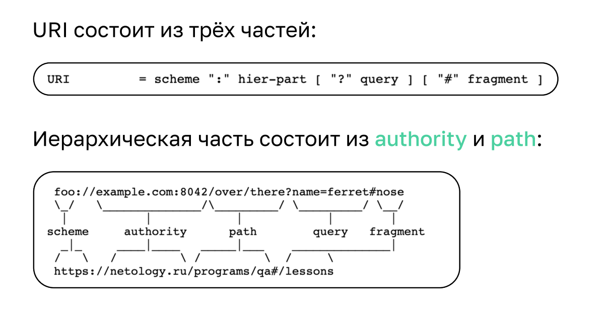

### Тестирование API. CI

#### API - Application Programming Interface
(спецификация программного взаимодействия двух систем)

С помощью API клиентская часть приложения может взаимодействовать с серверной частью.
Клиентом может быть как пользователь, так и другое приложение.

Взаимодействие между клиентом и сервером происходит через запросы
Передача осуществляется через инструмент доставки(протокол HTTP 1.1), а для понимания отправленной или полученной информации используется язык интерпретации(к примеру REST API c форматом данных JSON).

URI - Uniform Resource Identifier - уникальный идентификатор ресурса
URL - Uniform Resource Locators - уникальный адрес ресурса, является частью подмножества URI




**Request** 
Запрос состоит из
Request-Line(что мы хотим от сервера)
headers -метаинформация
CRLF(body - тело запроса с необходимой для взаимодействия информацией)


**Response** 
Ответ состоит из 
Status-Line(информация о том получили ли мы то, что хотели)
headers - метаинформация
CRLF(body - тело ответа с информацией)

##### Работа инструмента доставки HTTP определяется методами:
**GET** - просмотр

Этот метод является безопасным и идемпотентным, что значит, что многократные запросы с одинаковыми параметрами не будут изменять состояние ресурса. Обычно GET-запросы не содержат тела запроса и возвращаются с телом ответа, содержащим запрашиваемые данные.
   
    Примеры использования:
     1.  Получение списка всех пользователей.
     2.  Получение информации о конкретном пользователе.

**POST** - добавление

Используется для добавления новых ресурсов на сервер. Этот метод не является ни безопасным, ни идемпотентным, что означает, что повторные запросы могут создавать дополнительные ресурсы. POST-запросы часто содержат тело запроса, включающее данные нового ресурса, и возвращаются с телом ответа, подтверждающим успешное создание ресурса или предоставляющим дополнительную информацию.
  
    Примеры использования:
     1.  Создание нового пользователя.
     2.  Отправка формы обратной связи.

**PUT** - изменение

Используется для обновления существующих ресурсов на сервере. Этот метод является идемпотентным, что означает, что повторные запросы с теми же параметрами будут производить тот же эффект. PUT-запросы обычно содержат полное представление ресурса, которое заменит текущее состояние ресурса на сервере.

    Примеры использования:
     1.  Обновление информации о пользователе.
     2.  Замена всего содержимого документа.

**DELETE** - удаление

Используется для удаления ресурсов с сервера. Этот метод является идемпотентным, что означает, что повторные запросы после успешного удаления ресурса не будут приводить к каким-либо изменениям. DELETE-запросы обычно не содержат тела запроса и возвращаются с телом ответа, подтверждающим успешное удаление ресурса.

    Примеры использования:
     1.  Удаление конкретного пользователя.
     2.  Удаление комментария.

#### Дополнительно

Помимо этих основных методов, существуют и другие, такие как:

* PATCH: Используется для частичного обновления ресурсов. В отличие от PUT, PATCH предполагает обновление только некоторых полей ресурса.
* HEAD: Аналогичен GET, но возвращает только заголовки ответа без тела.
* OPTIONS: Используется для определения возможностей ресурса, поддерживаемых сервером.

#### Статусы кодов ответов.

* 1xx - информационные
* 2хх - успешно
* 3хх - перенаправление
* 4хх - ошибка клиента
* 5хх - ошибка сервера


#### JSON (JavaScript Object Notation)
Формат данных, предназначенный для передачи информации.
JSON позволяет представлять данные в виде пар ключ-значение, списков и вложенных объектов.


#### XLM (Extensible Markup Language)
Универсальный формат представления данных, который широко применяется для хранения и передачи структурированной информации.
Данные в XML представлены в виде дерева, состоящего из элементов (tags), атрибутов и текста. Каждый элемент может содержать другие элементы, создавая сложную иерархию.


#### REST API

REST - это архитектурный подход к проектированию систем, при котором вы представляете всю систему в виде набора ресурсов, чаще всего иерархических.
```
/users/:username/repos/:repo/
```

#### Пример запроса c помощью API в тесте 
```
// Given(дано) - When(когда) - Then(затем)
        // Предусловия
        given()
                .baseUri("http://localhost:9999/api/v1") // часть адреса сервера, которая остается неизменной в тестах

        // Выполнить
        .when() 
                .get("/demo/accounts")

        //Проверить
        .then()
                .statusCode(200)  //ответ со статусом кода 200
                .contentType(ContentType.JSON) // ответ представлен в формате JSON
                .header("Content-Length", matching(".*")) // в ответе указана длина 
                .header("Connection", "keep-alive") // тип соединения keep-alive - т.е постоянное
                .body("", hasSize(3)) // запрос на количество объектов
                // проверка на то, что у объекта [].параметр имеется equalTo(значение)
                .body("[0].id", equalTo(1)) 
                .body("[2].name", equalTo("Текущий зарплатный счёт"))
                .body("[1].currency", equalTo("USD"))
                .body("[0].balance", equalTo(992821429));
```


**Подсказки**

    SUT — System under test (артефакт) - это термин, для описания системы, которая тестируется.
    Артефакты имеют расширение jar и запускаются с помощью команды 
    java -jar ./artifacts/"название_файла".jar 

    Команда  git add -f artifacts/"название_файла".jar - используется для добавления файла в гитигнор,
    в качестве исключения.

#### Continuous Integration

Continuous Integration (CI), или Непрерывная интеграция, — это практика разработки программного обеспечения, при которой разработчики регулярно объединяют свои изменения в общий репозиторий кода. Обычно это происходит несколько раз в день. Цель непрерывной интеграции — выявить и устранить проблемы интеграции как можно раньше, предотвращая накопление ошибок и конфликтов.

Основные принципы Continuous Integration:
* Частое объединение кода: Разработчики интегрируют свои изменения в основной код базы ежедневно, что уменьшает риск возникновения крупных конфликтов.
* Автоматизация сборки и тестирования: Каждый коммит проходит автоматические процессы сборки и тестирования, что позволяет быстро обнаружить ошибки.
* Быстрая обратная связь: Разработчики получают немедленную обратную связь о состоянии своего кода, что помогает оперативно реагировать на возникающие проблемы.
* Качественный код: Постоянное тестирование и интеграция способствуют повышению качества кода, так как ошибки выявляются и устраняются на ранних этапах.

Наиболее популярные CI:
* «Jenkins», 
* «GitLab CI», 
* «AppVeyor», 
* «Travis», 
* «CircleCI», 
* «GitHub Actions».