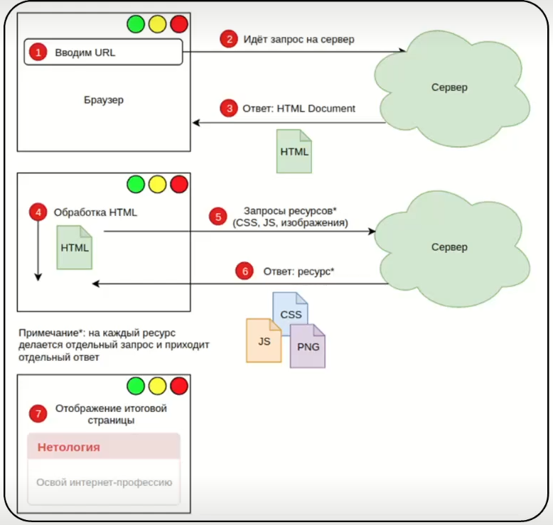
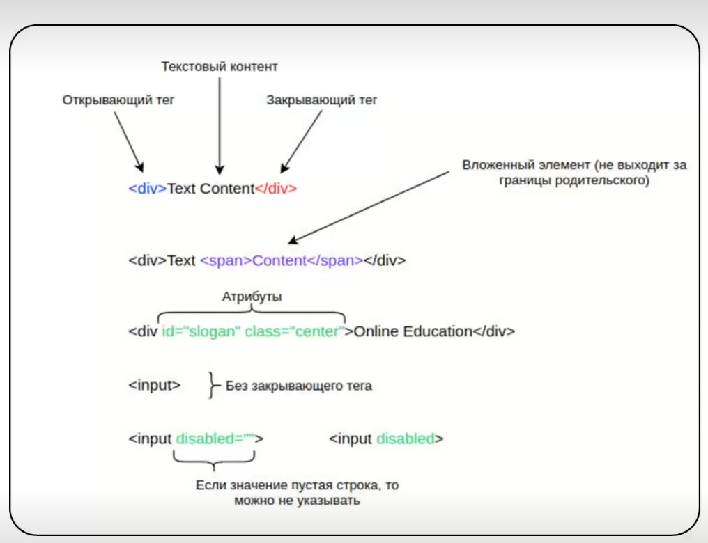
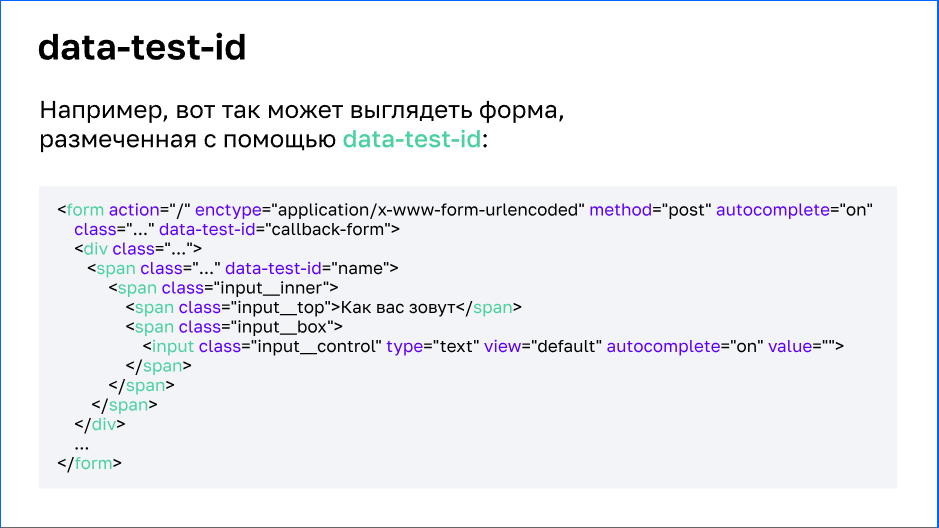

### Тестирование веб-интерфейсов, Selenium и Selenide

Веб-интерфейс - это то, что видит пользователь при открытии страницы в браузере.

Взаимодействие между браузером и сервером можно посмотреть по схеме.


Что можно автоматизировать в тестировании веб-интерфейса
- можно автоматизировать взаимодействие браузера на уровне НТТР

Основные понятия:
* HTML - язык, определяющий правила по формированию веб документов
* CSS - язык, определяющий правила по стилевому оформлению документов.
* JS - язык, использующий API браузера, чтобы добавить поведение элементам или переопределить их поведение по умолчанию (у некоторых элементов клик по ссылке или отправка формы приводит к загрузке новой страницы, JS позволяет сделать так, что бы страница не загружалась)

HTML элементы 


Атрибуты **id**(уникальный элемент) и **class**(атрибут группы) - два основных элемента, которые наиболее часто встречаются

#### Ключевые селекторы
- ```input``` - селектор тега поля для ввода
- ```#username``` - селектор по id
- ```.input_control``` - селектор по классу
- ```[type]``` - селектор по наличию атрибута
- ```[type='submit']``` - селектор по наличию атрибута со значением

#### Комбинации селекторов

* S1S2 (input.input_control) - ищет только те поля для ввода, у которых есть класс input_control 
* S1 S2 (form input) - ищет только те поля, которые находятся внутри form

Лучшей практикой для тестирования является договоренность между тестировщиком и программистами будет добавление в код тестовых меток



Пример запроса поиска input в консоле DevTools 
* ```$("[data-test-id='phone'] input")``` - поиск одиночного элемента, первого на странице
* ```$$("input")``` - поиск по коллекции элементов, показывает все элементы с таким наименованием

**Selenium** - один из инструментов для тестирования и управления браузерами

Драйвер - специальное промежуточное звено, реализующее протокол WebDriver и позволяющий Selenium единообразно общаться со всеми браузерами, именно он фактически осуществляет управление браузером.

Настройки драйвера на Selenium

```
private WebDriver driver;

    @BeforeAll
    static void setUpAll() {
        WebDriverManager.chromedriver().setup(); // метод настройки драйвера (для хрома) под текущее окружение
    }

    @BeforeEach
    void setup() {
        ChromeOptions options = new ChromeOptions(); //  набор параметров для драйвера
        options.addArguments("--disable-dev-shm-usage"); // отключает использование временного хранилища
        options.addArguments("--dno-sandbox"); // отключает песочницу безопасности
        options.addArguments("--headless"); // запускает браузер Chrome в режиме без графического интерфейса
        driver = new ChromeDriver(options); // сохраняем драйвер в переменной driver
        driver.get("http://localhost:9999"); // открываем страницу
    }

    @AfterEach
    void tearDown() {
        driver.quit();
        driver = null;
    }
```
