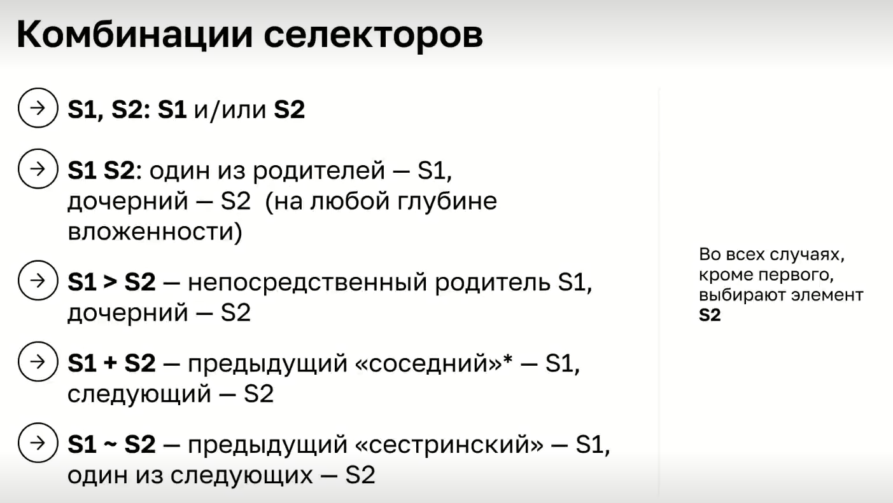
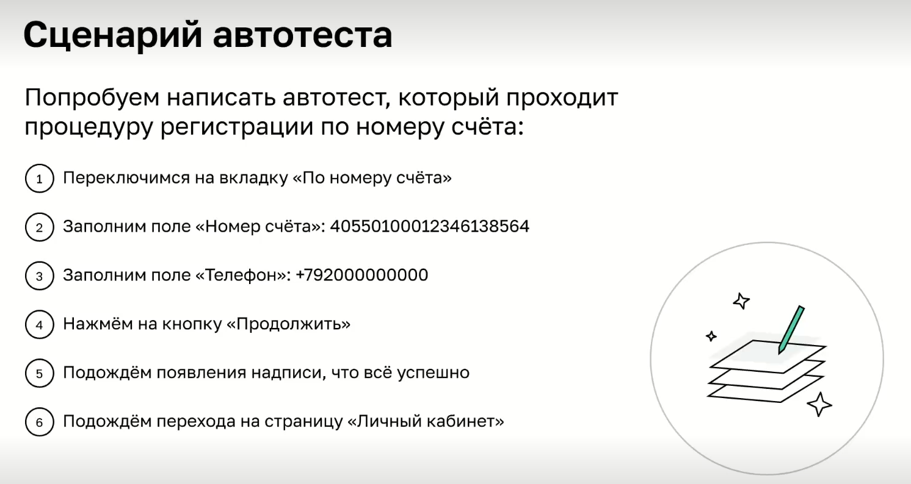

### Тестирование интерфейсов Selenide

Главное при взаимодействии с веб-страницей - найти нужные элементы, что позволит затем взаимодействовать с ними.
Selenide дает возможность при создании автотестов использовать не только css селекторы, но и встроенный в него
функционал.

Для поиска используются методы:

* $ - один элемент
* $$ - коллекция элементов
  Ключевые селекторы:
* по id: #id
* по классу .class
* по атрибуту:
    * наличие атрибута: [attr]
    * атрибут с определенным значением: [attr='value']



При работе с селекторами надо иметь ввиду то, что некоторые сайты разработаны таким образом, что при переходе по
вкладкам, часть элементов удаляется.
Подобное возможно благодаря тому, что браузер используется DOM API

SPA(Single page application) - подходи, при котором вместо загрузки нового HTML документа при каждой отправке формы,
клике, и тд. просто перестраивается девево DOM
Дерево генерируется с помощью JS и DOM API, а URL в адресной строке меняется посредством JS и History API
(у пользователя появляется ощущение перехода по страницам).

XHR & Fetch
Если нужно взаимодействовать с сервером из JS c помощью AJAX-запросов и других технологий, отправляются запросы и
принимаются ответы
без перезагрузки страницы.
Таким образом, HTML, CSS и JS загружаются только при первой загрузке страницы, а в дальнейшем между сервером и браузером
передаются только данные

### Написание теста



```    
       // Примеры методов Selenide
       Selenide.open("http://localhost:8082"); //открытие страницы
       //$("") -  поиск элемента
       //$$("")  - поиск коллекции элементов
       //actions()  - выполнить действие, к примеру переместить указатель мыши
       //refresh()  - обновление страницы
       //screenshot() - сделать скриншот
       //$$(".tab-item").last().click();  // переход на вторую вкладку через коллекцию элементов.
       
       //Поиск по селектору:    
       $$(".tab-item").findBy(Condition.text(""));
       //.findBy(Condition.attribute("")) - поиск по атрибуту
       //.findBy(Condition.text("")) - поиск по тексту 
       //.findBy(Condition.exactText("") -  по точному совпадению текста
       //.findBy(Condition.and("")) - используется для группировки (alloff/anyof)
       //.findBy(Condition.cssClass("")) - поиск по классу
       //.findBy(Condition.cssValue("")) - поиск по значению
       //.findBy(Condition.id("")) - поиск по айди
       //.findBy(Condition.visible()) - поиск видимого элемента
       //.findBy(Condition.exists()) - поиск элемента, который существует, но при этом может быть не видим
       //.findBy(Condition.text("По номеру счета")).ancestor("") - поиск соседа элемента 
       //.findBy(Condition.text("По номеру счета")).parent("") - поиск родителя элемента 
       //.findBy(Condition.text("По номеру счета")).hover() - навести курсор на элемент
       //.findBy(Condition.text("По номеру счета")).clear() - очистить 
       
       // Внутренние селекторы Selenide используются, когда нет возможности открыть код элемента
       $(Selectors.byText("Успешная авторизация! Вы будете перенаправлены в течение нескольких секунд."));  - поиск по полному совпадению
       // Selectors.withText("") - частичное совпадение 
       // Selectors.byPartialLinkText("") -  по ссылке   
       
       // Selenide ожидает результат 4 секунды, если необходимо увеличить время то используется Duration.ofSeconds(15)   
```

Доп.информация: для запуска тестов в headless режиме(без открытия браузера) необходимо прописать команду
```.\gradlew clean test "-Dselenide.headless=true"```


