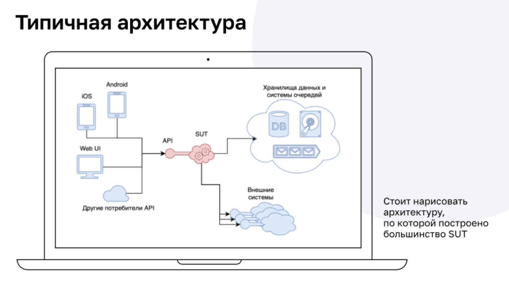

### Patterns

**Паттерн** — это устоявшийся способ решения типовой, часто встречающейся задачи или проблемы.

Расстановка приоритетов при тестировании

* Happy Path - если клиент все сделал правильно, то должен получить правильный результат
* Sad Path - если клиент сделал что-то не правильно, то должен получить корректное уведомление об этом.
* Evil Path - если клиент пытается взломать систему, то система должна выстоять и уведомить соответствующие службы.

Расстановка приоритетов зависит от того, что тестируется, а так же какое время есть на тесты.

##### Примеры сценариев (паттернов) перевода денег с карты одного клиента на карту другого клиента

**Первый пользователь**
1. Осуществляем процедуру входа в интернет-банк - нужно подтвердить кодом из СМС или PUSH
2. Выбираем операцию перевода денег другому клиенту
3. Вводим телефон другого клиента, сумму, нажимаем перевести - нужно подтвердить кодом из СМС или PUSH
4. Удостоверяемся, что на счете нашей карты стало меньше денег на сумму равную сумме перевода
5. Выходим из интернет-банка.

**Второй пользователь**
1. Осуществляем процедуру входа в интернет-банк другим пользователем(подтверждаем авторизацию кодом из СМС или PUSH)
2. Удостоверяемся, что на счете карты стало больше денег на сумму равную сумме перевода
3. Выходим из интернет-банка.

##### Сценарий при переводе между своими картами
1. Осуществляем процедуру входа в интернет-банк - нужно подтвердить кодом из СМС или PUSH
2. Выбираем операцию перевода денег с карты на карту
3. Выбираем карты и сумму, нажимаем перевести (подтверждение кодом не нужно)
4. Удостоверяемся, что денег на одной карте стало больше
5. Удостоверяемся, что денег на другой карте стало меньше
6. Выходим из интернет-банка.

#### Тестовые данные 

Способы получения: 
* Реальные данные - после процедуры анонимизации данные
  пользователей можно будет использовать, но в результате
  этого можно потерять отражение реальной статистики
* Хардкодинг - Данные пользователя зашиваются в SUT и в наши тесты, с одной стороны это упрощает работу, с другой стороны если SUT из себя представляет «чёрный
  ящик», то мы не можем из тестов или системы CI управлять этими данными
* Генерация - Мы можем воспользоваться существующими решениями
  или самостоятельно написать генератор данных, к примеру использовать библиотеку Faker

Сколько данных нужно (два самых часто применяемых подхода):
* Сгенерировать столько данных, сколько нужно для независимости тестов от данных: каждому тесту — свои данные
* Запускать тесты так, чтобы даже если они используют одинаковые данные, то пересечения по данным не происходило (речь идёт о том, чтобы прогонять тесты не на одном и том же экземпляре SUT, а на нескольких независимых)

Как положить тесты в SUT:

* Графический интерфейс — то же, через что тестируем
* API — отдельное REST API, позволяющее делать многие вещи быстрее
* Напрямую в СУБД или иное хранилище SUT
* Специальный тестовый режим SUT, при котором ей можно «скормить» демоданные
* Сервисный доступ — одна из идей удобного управления состоянием SUT, похожим на тестовый. Когда, обладая определённым кодом доступа (или токеном) или выполняя запросы с определённых доверенных IP-адресов, SUT предоставляет расширенные возможности через своё API

Внешние системы

Система отправки СМС — внешняя по отношению к интернет-банку, и мы не можем оттуда просто так получить значение кода подтверждения. При работе с внешними системами ключевой проблемой является получение доступа к ним.

Решение:
* Заглушки для внешних систем - Пишутся упрощённые варианты сервисов, а из тестов уже обращаемся к ним.
* Proxy для внешних систем - Механизм, при котором мы перехватываем запросы от SUT к реальным системам. Можем возвращать ответ как от реальной системы, так и предопределённый Удобно, если SUT интегрируется с внешними системами по распространённым протоколам, например HTTP
* Реальная интеграция -Лучший способ, если вы хотите действительно всё проверить целиком, но самый ресурсоёмкий, медленный и дорогостоящий

