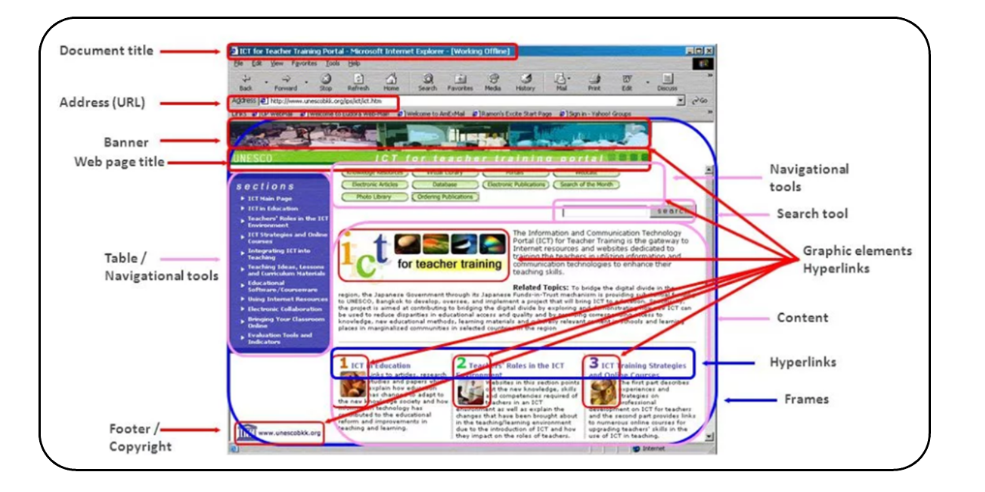

###  BDD

Абстракция - создание класса для объекта(пример - страница сайта)

Инкапсуляция - методы (действия) для работы с абстракцией

Page Object - класс в который вносится информация, с характерной для страницы логикой

Пример создания Page Object - вкладки на странице - каждая вкладка - свой объект

