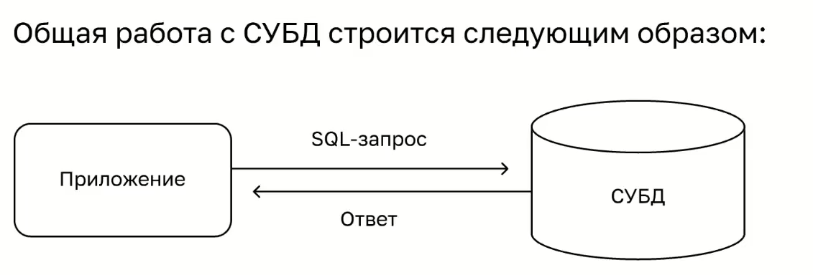
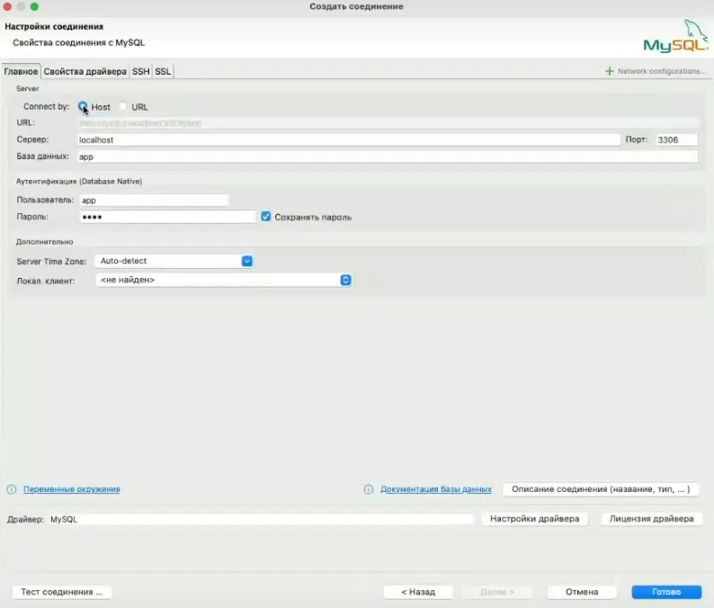
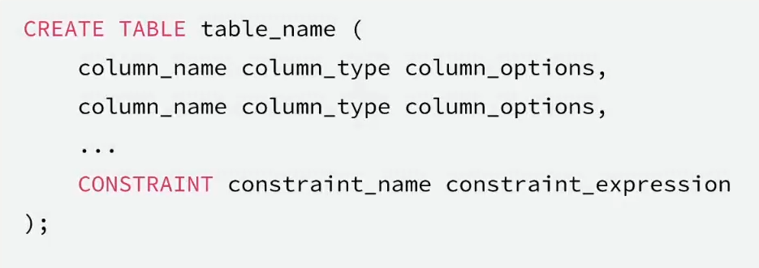
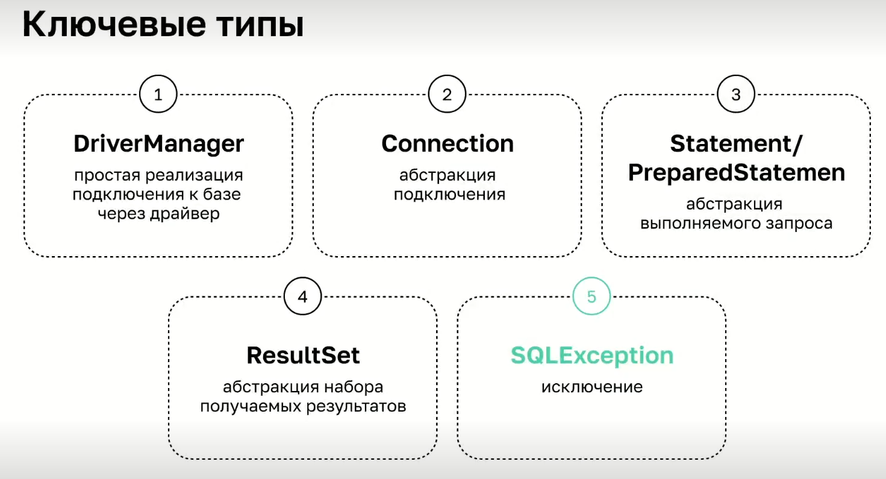
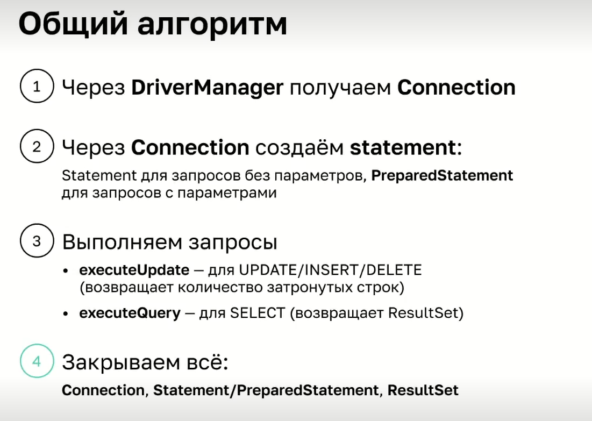

### SQL

Большое количество информации привело к необходимости создания баз данных(БД), которые позволяли:
* структурировать данные 
* получать конкурентный доступ, то есть возможность не только читать, но и модифицировать информацию
* обеспечивать транзакционность, когда атомарные(неделимые) операции должны быть выполнены полностью в виде одного атомарного блока(если одна из операций не была выполнена, то результаты всех остальных операций блока должны быть отменены)

Самые распространенные на данный момент базы данных работают на SQL.

**SQL** - это общее название языка, который используется в SQL базах данных. 
Так же на языке SQL разрабатываются стандарты

**Диалекты** - это некоторые особенности синтаксиса конкретной БД, которые могут не поддерживаться в других базах данных.


**MySQL** один из видов баз данных.

Для подключения к БД используются:
- консольный клиент, который, как правило, идет в комплекте к БД 
- клиент с UI (DBeaver, PL/SQL Developer, встроенные в IDE клиенты)
- подключаться из кода на Java

Подключение к БД через консоль
````
docker compose exec mysql mysql -u app -p app 

// exec  - команда для подключения к контейнеру
// mysql - указание на то, к какому контейнеру будет подключение
// mysql - информация о том, что внутри контейнера необходимо подключить консольный клиент mysql
// -u app - информация о пользователе
// -p - информация о том, что будет введен пароль
// app - название базы данных

````

```
mysql> show databases;  // выводит информацию о том, какие базы находятся внутри подключенной базы
mysql> use app // команда для входа в базу данных внутри общей БД

mysql> show tables; // выводит информацию о таблицах сохраненных в БД

```

**Структура БД**

Структура баз данных состоит из таблиц.
Таблицы состоят из столбцов и строк.
* Столбцы имеют конкретный тип и ограничения, и определяют структуру информации поля
  * Строки представляют хранимые записи данных



MySQL работает в виде сетевого сервиса, который в Docker-контейнере запущен на порту 3303.

#### Создание нового подключения в DBeaver
1. Нажать на "+"
2. Выбрать тип базы данных (MySQL)

при первом подключении возможно потребуется скачать дополнительный драйвер.
3. Нажать на "тест соединения"
если потребуется, в свойствах соединения в свойстве allowPublicKeyRetrieval указать значение TRUE
4. Нажать "Готово"

Процесс работы с БД

1. Определить схему для работы с БД(структуру информации)
2. Осуществить запрос к базе данных (создать, обновить, удалить запись, сделать выборку данных)

Структура определяется в языке DDL (Data Definition Language)
Создание таблицы


Пример создания таблиц БД

На верхнем уровне необходимо нажать "Редактор SQL", далее "Open console"
Вставить скрипт и нажать "Выполнить скрипт"
```
CREATE TABLE users
(
    id       INT PRIMARY KEY AUTO_INCREMENT,
    login    VARCHAR(255) NIQUE NOT NULL,
    password VARCHAR(255)       NOT NULL,
);

CREATE TABLE cards
(
   id                  INT PRIMARY KEY AUTO_INCREMENT,
   user_id             INT NOT NULL,
   number              VARCHAR(19) NIQUE NOT NULL,
   balance_in_kopecks  INT               NOT NULL DEFAULT 0,
   FOREIGN KEY (user_id) REFERENCES users  (id)
);

CREATE TABLE auth_codes
(
   id          INT PRIMARY KEY AUTO_INCREMENT,
   user_id     INT NOT NULL,
   code        VARCHAR(6) NOT NULL,
   created     TIMESTAMP NOT NULL DEFAULT CURRENT_TIMESTAMP,
   FOREIGN KEY (user_id) REFERENCES users  (id)
 
);

CREATE TABLE card_transactions
(
   id          INT PRIMARY KEY AUTO_INCREMENT,
   source      VARCHAR(19) NOT NULL,
   target      VARCHAR(19) NOT NULL,
   amount_in_kopecks INT               NOT NULL,
   created     TIMESTAMP NOT NULL DEFAULT CURRENT_TIMESTAMP
);

```

Ключевые моменты
* NOT NULL - в колонку нельзя записать NULL(отсутствие значения)
* CHECK(expression) - перед вставкой/обновлением проверяет истинность выражения
* DEFAULT expression - значение колонки по умолчанию, если не указано иное
* UNIQUE - указывает, что в данной колонке не может быть строк с таким же значением
* PRIMARY KEY - первичный ключ(уникальная идентификация строки среди всех строк)
* REFERENCES table_name (columns) - внешний ключ (ссылка на другую, или ту же таблицу)

Операции

* DROP TABLE table_name - удаление таблицы
* ALTER TABLE table_name - редактирование таблицы

**DML**
Ключевые запросы манипуляции данными

* INSERT - вставить данные

```
INSERT INTO users (id, login, password)
VALUES (1, "vasya", "password");

INSERT INTO users (id, login, password)
VALUES (2, "petya", "password");

INSERT INTO cards (id, user_id, number, balance_in_kopecks)
VALUES (1, 1, "5559000000000001", 1000000),
       (2, 1, "5559000000000002", 1000000);

INSERT INTO card_transactions (source, target, amount_in_kopecks)
VALUES ("5559000000000001", "5559000000000002", 10000);

```
* UPDATE - обновить данные через транзакцию
```
START TRANSACTION;

UPDATE cards
SET balance_in_kopecks = balance_in_kopecks - 10000
WHERE number = "5559000000000001";

UPDATE cards
SET balance_in_kopecks = balance_in_kopecks + 10000
WHERE number = "5559000000000002";

COMMIT; 

```
* DELETE - удалить данные

```
DELETE FROM auth_codes WHERE created < NOW() - INTERVAL 5 MINUTE;

DELETE FROM auth_codes // удаляет запись из таблицы
WHERE created < // в колонке 
NOW() - INTERVAL 5 MINUTE; // все записи сделанные в последние 5 минут

```

Оператор WHERE поддерживает:
* операторы сравнения: <, >, <=, >=, <>(не равно !=), =
* проверка на вхождение в интервал: IN(A,B,C), BETWEEN A AND B
* проверка значений на NULL: IS NULL, IS NOT NULL
* логические операторы: AND, OR, NOT

**DQL(DRL)**

Выборка данных осуществляется с помощью оператора SELECT
```
-- выборка всех столбцов и всех строк из таблицы users (будьте осторожны на больших таблицах)
SELECT * FROM users;
-- выборка только определённых столбцов
SELECT id, login FROM users;
-- выборка по условию
SELECT balance_in_kopecks FROM cards WHERE number = "5559000000000002";
-- вычисляемые столбцы
SELECT balance_in_kopecks / 100 AS balance_in_rub FROM cards WHERE number = "5559000000000002";
--максимальное значение балансов для всех карт
SELECT max(cards.balance_in_kopecks) FROM cards;
--складывает значения из колонки баланс в таблице кардс для пользователя 1
SELECT sum(balance_in_kopecks) FROM cards WHERE user_id = 1;
--группирует - указывает какое количество карт в таблице кардс для всех пользователей
SELECT count(*), user_id FROM cards GROUP BY user_id;
```

Подключение к БД через код на java





