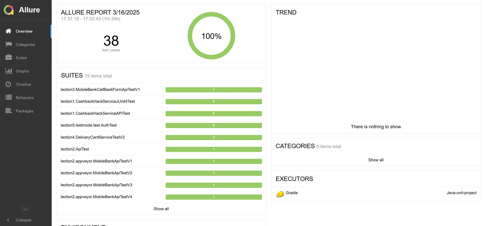

### Allure 
Allure — это платформа для создания отчетов о тестировании. 
Его основная задача — предоставить максимально наглядное представление о результатах проделанной работы. Он позволяет увидеть всю картину тестирования, понять, какие тесты были выполнены, какие из них прошли успешно, а какие — нет, и какие ошибки возникли.



#### Основные преимущества Allure:

* Визуализация результатов: Allure отображает результаты тестов в удобном и понятном формате. Вы можете видеть, какие тесты прошли успешно, а какие — нет, а также детальную информацию о каждом тесте, включая время выполнения, логи и скриншоты. 
* Поддержка различных языков программирования и фреймворков: Allure интегрируется с различными языками программирования, такими как Java, Python, JavaScript и другими. Это делает его универсальным инструментом, который подходит для большинства проектов.
* Подробная информация о тестах: Allure предоставляет детальные сведения о каждом тесте, включая шаги выполнения, параметры, результаты и любые возникшие ошибки. Вы можете легко проследить путь выполнения каждого теста и понять, на каком этапе возникла проблема.
* Гибкость и настраиваемость: Allure позволяет создавать отчеты в различных форматах, настраивать внешний вид и содержание отчетов, а также добавлять свою информацию. Вы можете адаптировать отчеты под нужды вашего проекта и команды.
* Упрощение анализа результатов: Благодаря наглядности и структурированности отчетов, Allure существенно упрощает процесс анализа результатов тестирования. Вы можете быстро найти нужную информацию и понять, какие проблемы нужно устранить.

#### Подключение в файле build:
```
plugins {

    id 'io.qameta.allure' version '2.11.2'
}

allure {
    version = '2.20.1'
    useJUnit5 {
        version = '2.20.1'
    }
}

dependencies {

    testImplementation 'io.qameta.allure:allure-selenide:2.20.1'
}
```

#### Подключение в тестах:
```
    // команда для запуска из командной строки 
    // .\gradlew allureserve - команда для запуска аллюре
    
    
    //Подключение логера для сбора информации.
    @BeforeAll
    static void setUpAll() {
        SelenideLogger.addListener("allure", new AllureSelenide());
    }

    @AfterAll
    static void tearDownAll() {
        SelenideLogger.removeListener("allure");
    }
```

