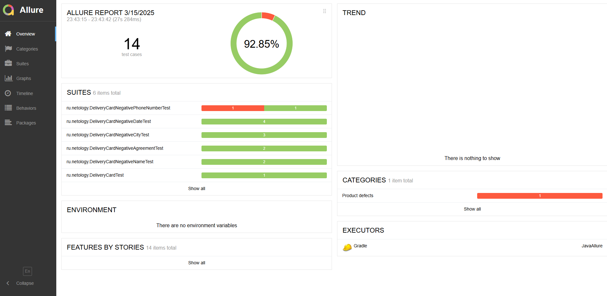
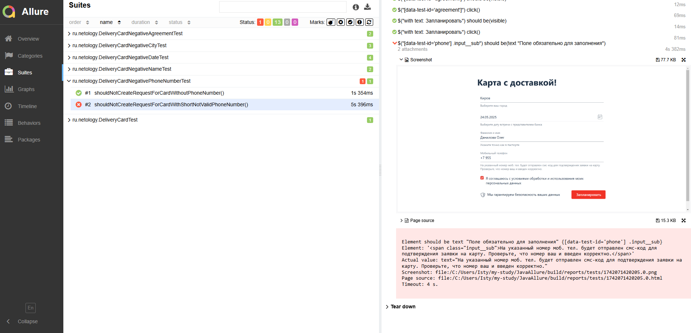

### Задача №1: проснулись (Allure)

В одном из предыдущих проектов **Patterns** вы тестировали функциональности заказа карт.

Ваше руководство узнало на конференции про такой замечательный инструмент, как Allure, который позволяет делать репортинг более наглядным и требует от вас интегрировать его в ваши тесты.

Начать решили именно с функции доставки карт:


Вам нужно:   
* взять ваш проект (см. «Как сдавать задачи») и прикрутить туда Allure, интегрированный с 
<details>

Добавить в файл ```build.gradle```:

```
plugins {

    id 'io.qameta.allure' version '2.11.2'
}

allure {
    version = '2.20.1'
    useJUnit5 {
        version = '2.20.1'
    }
}

dependencies {

    testImplementation 'io.qameta.allure:allure-selenide:2.20.1'
}
```

Добавить в файл с тестом:

```
    @BeforeAll
    static void setUpAll() {
        SelenideLogger.addListener("allure", new AllureSelenide());
    }

    @AfterAll
    static void tearDownAll() {
        SelenideLogger.removeListener("allure");
    }
```

</details>

* удостоверится, что при локальном запуске всё работает, отчёты генерируются.
* запустить отчет allure с помощью команды ```.\gradlew allureserve ```
* приложить в файл README репозитория скриншоты отчета Allure.
* оформить issue на найденный баг

### Задача №2: Report Portal (необязательная)
Мы сразу предупреждаем, что это задача может оказаться очень сложной, так как мы вас поставим в такие условия, когда разбираться придётся самим. Будьте готовы к этому и в работе, ведь такое обязательно может случиться — кто-то решит попробовать использовать определённую технологию, а разбираться, настраивать и устанавливать всё вам придётся самостоятельно. Кроме того, что нужно будет разобраться, нужно ещё и задокументировать это для будущих поколений, чтобы они не тратили столько же времени, сколько потратите вы.

При этом вы должны понимать, что в отличие от материалов курса, которые проверены его авторами, информация, содержащаяся в онлайн-источниках, может быть неполной, устаревшей и даже ошибочной.

Что нужно сделать: 
* попробовать интегрировать ваш проект тестирования доставки карт с Report Portal. Нам будет достаточно, если логи вашего теста будут отправляться в запущенный экземпляр Report Portal.

Как это сделать: 

* у вас есть несколько ссылок, с которых следует начать поиск:

https://reportportal.io/,

https://github.com/reportportal.

В результате:

* выполняете интеграцию вашего проекта с Report Portal и выкладываете краткий manual в виде README.md, в котором описываете необходимые действия для воспроизведения вашей интеграции. Так же как и в первой задаче в README.md необходимо добавить скриншоты полученных с помощью Report Portal отчетов.

Подсказка

Достаточно часто разработчики решений предоставляют готовые Docker-файлы и даже docker-compose.yml, для того чтобы вы могли быстро развернуть сервис и попробовать его в действии.
Часто такое бывает, что в официальном репозитории на GitHub выкладываются примеры интеграции. Возможно, стоит посмотреть там информацию о стеке используемых вами технологий, как минимум JUnit5.

### Домашнее задание к занятию «4.1. Репортинг»




